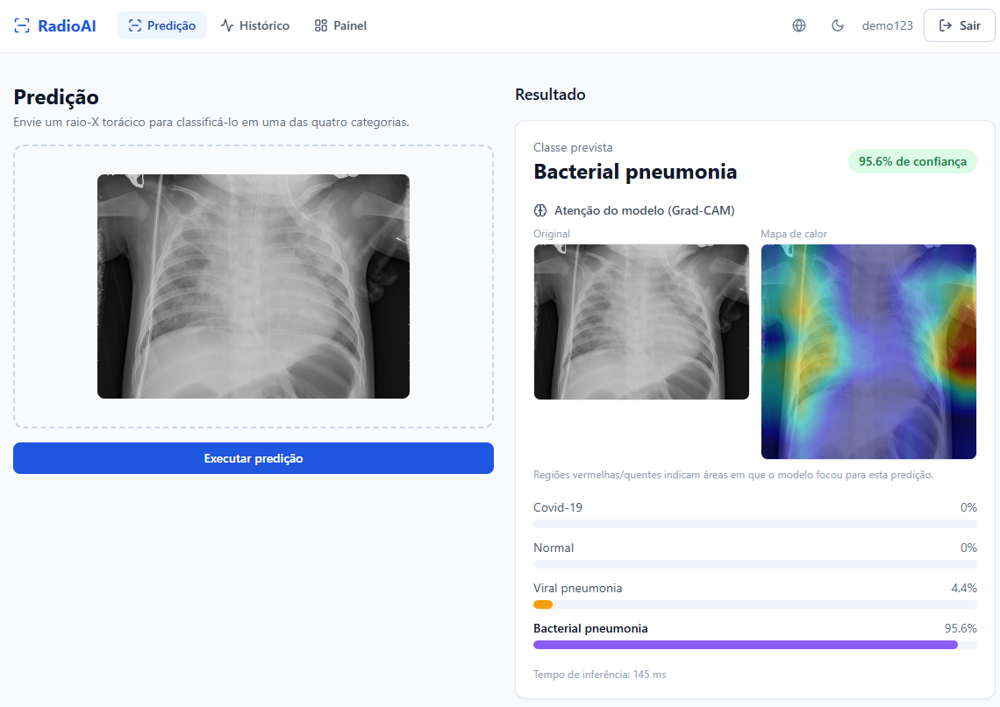
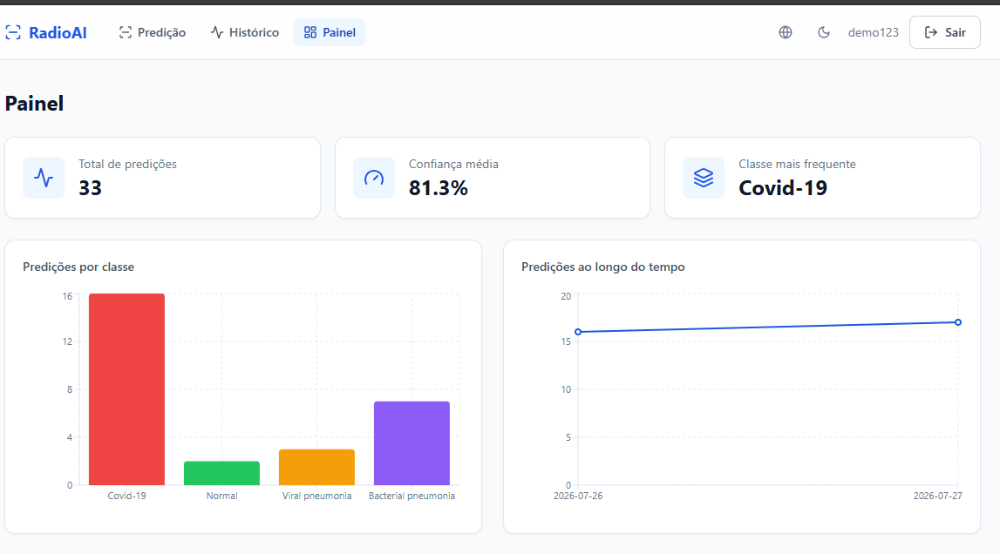
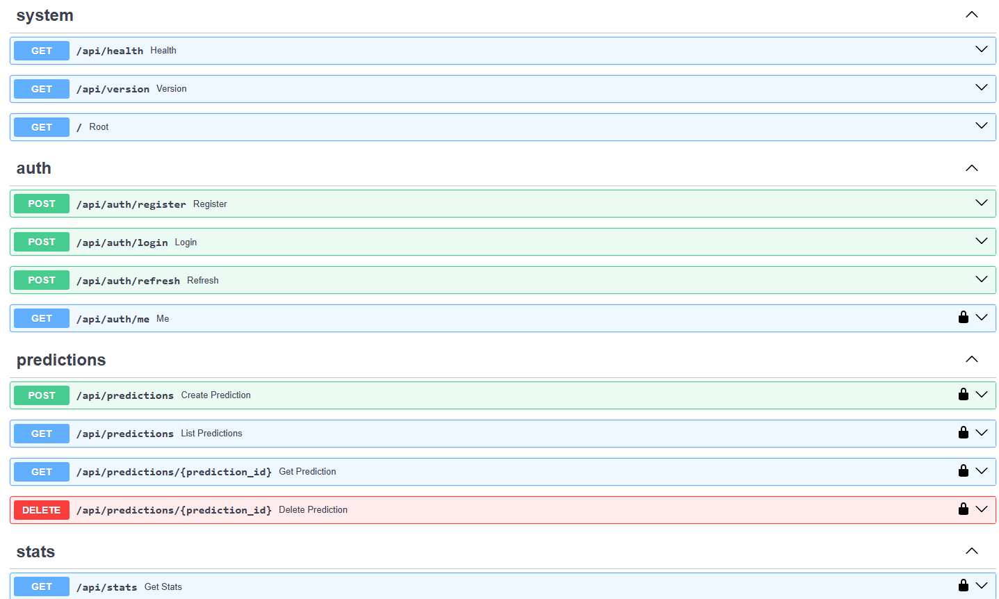
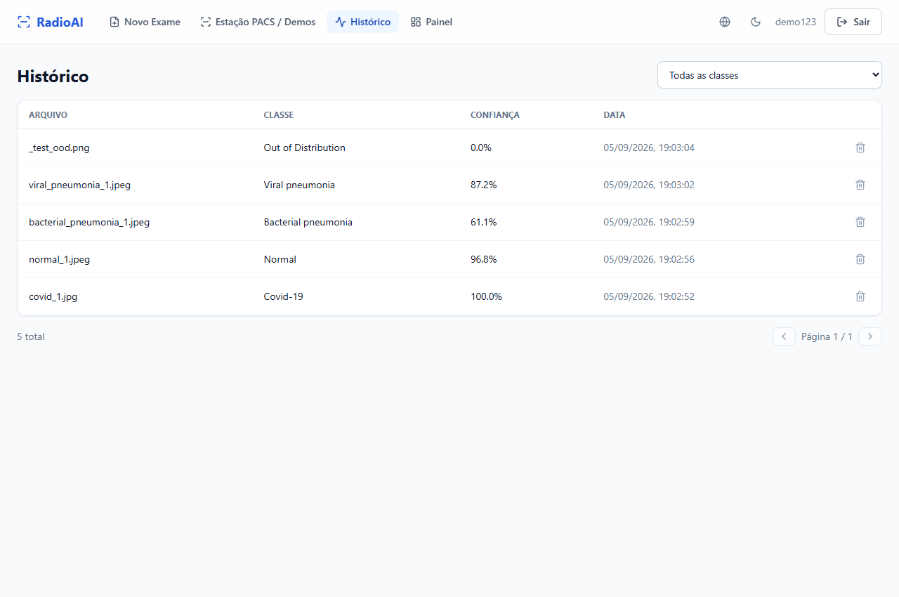
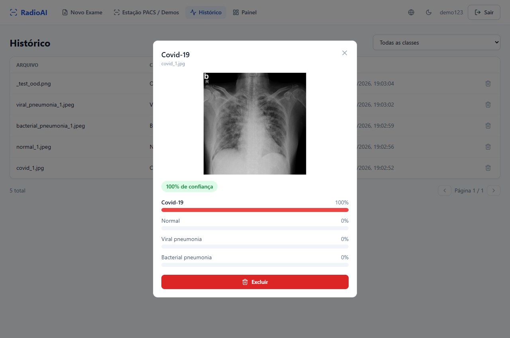
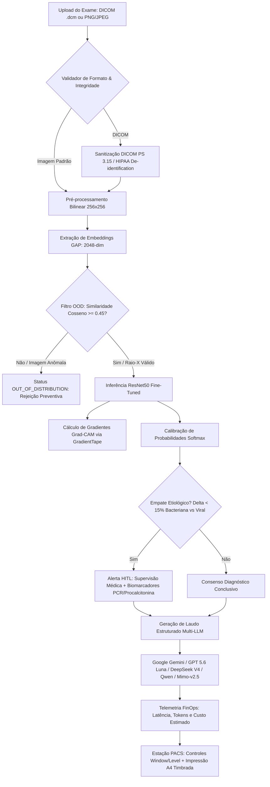

# 🩺 RadioAI — Plataforma Hospitalar de IA para Triagem e Explicabilidade Radiológica

> Sistema médico de alta disponibilidade para suporte à decisão diagnóstica em radiografias torácicas. Incorpora **Visão Computacional (ResNet50)**, **Explicabilidade Visual (Grad-CAM)**, **Segurança Clínica com Detecção Out-of-Distribution (OOD)**, **Ingestão Hospitalar DICOM PS 3.15**, **Laudos Multi-LLM** e **Observabilidade FinOps**.

[](https://radioai-1003760453129.us-central1.run.app)
[-4285F4?style=for-the-badge&logo=google-cloud&logoColor=white)](https://cloud.google.com/run)
[-brightgreen?style=for-the-badge&logo=github-actions&logoColor=white)](https://github.com/henriquebotelhogomes/Departamento_Medico_ML/actions)
[](docs/)
[-blueviolet?style=for-the-badge)](docs/)
[](docs/)

---

## ⚡ Guia Rápido do Recrutador / Avaliador Técnico (Teste em 30 Segundos)

Para testar a plataforma sem necessidade de clonar o repositório ou instalar dependências locais:

1. **Acesse a Aplicação:** [RadioAI Live Demo (Google Cloud Run)](https://radioai-1003760453129.us-central1.run.app) *(ou execute localmente via Docker)*
2. **Credenciais One-Click:**
   - **Usuário:** `demo123`
   - **Senha:** `demo123`
3. **Galeria 1-Click Demo na Tela Principal:**
   - Clique em qualquer um dos **6 casos clínicos pré-carregados** (Normal, Covid-19, Pneumonia Bacteriana, Pneumonia Viral, Anomalia OOD ou Exame DICOM hospitalar).
   - **Observe:**
     - **Heatmap Grad-CAM Dinâmico:** Ajuste o slider de transparência (0% a 100%) para verificar os infiltrados pulmonares destacados pela rede neural.
     - **Controles PACS:** Teste o janelamento (*Window/Level*), contraste e a **Inversão Monocromática** (padrão-ouro radiológico para detecção de nódulos).
     - **Geração de Laudo Multi-LLM:** Selecione entre Gemini, GPT 5.6 Luna, DeepSeek V4, Qwen ou Mimo-v2.5 e veja a telemetria de **tokens consumidos, latência e custo FinOps** em tempo real.
     - **Impressão Hospitalar A4:** Clique em *Imprimir Laudo* para visualizar a folha timbrada pronta para assinatura médica (CRM/RQE).

---

## 📊 Métricas de Impacto de Engenharia & Performance Clínica

| Dimensão Técnica | Métrica / Resultado | Impacto Clínico / Negócio |
| :--- | :--- | :--- |
| **Acurácia em Teste Independente** | **92.5%** (com Test-Time Augmentation) | Avaliado no dataset Kaggle (~400 imgs), nunca exposto no treinamento. |
| **Segurança contra Falsos Diagnósticos** | **100% de Rejeição OOD** | Rejeição imediata de imagens cotidianas (cães, carros, documentos) via distância cosseno em embedding space 2048-d. |
| **Latência de Inferência (P95)** | **< 180ms** (síncrona em CPU) | Permite triagem emergencial instantânea em salas de atendimento. |
| **Infraestrutura & Custo Operacional** | **$0.00 / mês** (Google Cloud Run) | Arquitetura conteinerizada serverless com política *Scale-to-Zero* (min-instances=0). |
| **Conformidade de Privacidade** | **DICOM PS 3.15 (HIPAA / LGPD Art. 11)** | Desidentificação de PatientID, PatientName e metadados antes de qualquer persistência. |
| **Confiabilidade de Software** | **54 Testes Automatizados** (37 backend + 17 frontend) | Pipeline de CI/CD rigoroso com Git Hooks globais (Ruff, Pytest, ESLint, Vitest). |

---

## 📸 Demonstração da Estação PACS & Recursos

<p align="center">
  
</p>

<p align="center"><em>Estação PACS médica com <strong>mapa de atenção Grad-CAM</strong>: a rede neural classifica o raio-X e destaca as regiões pulmonares de maior relevância diagnóstica, garantindo explicabilidade clínica.</em></p>

| Painel Analítico & FinOps | Documentação Interativa da API (Swagger) |
| :---: | :---: |
|  |  |
| Volume total, distribuição por patologia, telemetria de tokens e custos estimados por LLM. | API RESTful assíncrona documentada automaticamente (OpenAPI 3.1) com autenticação JWT. |

| Histórico Clínico & Filtro OOD | Detalhe Diagnóstico & Probabilidades |
| :---: | :---: |
|  |  |
| Histórico filtrável por patologia. Imagens que não são raio-X são marcadas como **Out of Distribution**, impedindo diagnósticos incorretos. | Distribuição calibrada de probabilidades entre todas as classes diagnósticas e visualização em alta resolução. |

---

## 🏗️ Arquitetura do Sistema Hospitalar



---

## 💎 Diferenciais Técnicos & Inovações de Engenharia

### 1. Segurança Clínica & Rejeição Out-of-Distribution (OOD)
A maioria dos modelos em produção sofre de *falsa certeza algorítmica*: ao receber a foto de um animal ou paisagem, forçam uma predição médica com 99% de certeza. O RadioAI calcula a similaridade cosseno entre o vetor de 2048 dimensões da camada Global Average Pooling e o centróide do espaço de raios-X torácicos. Imagens fora da distribuição são **imediatamente rejeitadas** com status `OUT_OF_DISTRIBUTION`.

### 2. Padrão Hospitalar DICOM PS 3.15 & Desidentificação
Suporte nativo a arquivos `.dcm` médicos com remoção automática de *Protected Health Information (PHI)* — incluindo nomes, números de prontuário, CPFs e datas de nascimento — em total conformidade com a **LGPD (Art. 11)** e **HIPAA Safe Harbor**, preservando metadados radiológicos essenciais (kVp, incidência PA/AP, modalidade CR/DX).

### 3. Observabilidade & FinOps de LLM em Tempo Real
Ao gerar laudos radiológicos com múltiplos provedores de ponta (**Google Gemini 3.8/2.5 Flash**, **GPT 5.6 Luna**, **DeepSeek V4 Flash**, **Qwen 3.8 Flash**, **Mimo-v2.5** ou **Motor Local Offline**), a aplicação rastreia:
- Consumo exato de prompt tokens e completion tokens.
- Latência de inferência em milissegundos.
- Custo financeiro estimado por exame emitido.

### 4. Human-in-the-Loop (HITL) com Biomarcadores
Quando a rede neural identifica dúvida etiológica estreita ($\\Delta < 15\\%$, como no dilema clínico de 51% Pneumonia Bacteriana vs 49% Viral), o sistema aciona uma trava de segurança diagnóstica. O médico assistente pode registrar a dosagem de **Procalcitonina** e **Proteína C-Reativa (PCR)**, sobrescrevendo a conduta de forma auditada e soberana.

### 5. Estação PACS com Inversão Monocromática e Impressão A4
Interface desenvolvida em React 18 e Tailwind CSS que simula uma estação radiológica moderna: ajuste de brilho (50%-200%), contraste (50%-250%), zoom tátil, slider Grad-CAM e **inversão monocromática** para identificação de nódulos sutis. O motor de impressão gera um laudo A4 timbrado pronto para carimbo e assinatura do médico radiologista.

---

## 🔬 Datasets & Estratégia de Treinamento

| Conjunto | Volume | Proporção | Fonte | Finalidade |
| :--- | :--- | :--- | :--- | :--- |
| **Treinamento** | 4.065 imagens | 85% | Mendeley Chest X-ray (Curado) | Fine-tuning seletivo das camadas `conv5_block` |
| **Validação** | 717 imagens | 15% | Mendeley Chest X-ray (Curado) | Early stopping e ajuste de hiperparâmetros |
| **Teste Cego** | ~400 imagens | Independente | Kaggle COVID-19 Radiography | Avaliação final de generalização sem viés |

* **Prevenção de Data Leakage:** Deduplicação perceptual por hashes dHash entre os datasets.
* **Fine-Tuning Seletivo:** 22 camadas descongeladas com learning rate 100x menor ($1 \\times 10^{-5}$) e Batch Normalization congelada para evitar instabilidade estocástica.
* **Test-Time Augmentation (TTA):** 10 augmentações rotacionais/contraste combinadas para elevar a acurácia no teste cego de **87.5% para 92.5%**.

---

## 🛠️ Tech Stack Completa

| Camada | Tecnologias |
| :--- | :--- |
| **Machine Learning & Visão** | TensorFlow 2.21 · Keras 3.15 · ResNet50 · Grad-CAM · OOD Embeddings (GAP 2048-d) |
| **Padrão Hospitalar** | Pydicom · DICOM PS 3.15 (Anonimização HIPAA/LGPD) · Estação PACS |
| **GenAI & Laudos Clínicos** | Google Gemini 3.8 · GPT 5.6 Luna · DeepSeek V4 · Qwen 3.8 · Mimo-v2.5 · Motor Local |
| **MLOps & FinOps** | MLflow · Telemetria de Tokens/Custos em Tempo Real · Drift (Chi-Squared/KS) |
| **Backend API** | Python 3.12 · FastAPI · Pydantic v2 · SQLAlchemy 2 (async) · uv · SlowAPI |
| **Frontend PACS** | React 18 · TypeScript · Tailwind CSS · TanStack Query · i18next · Lucide |
| **Banco & Storage** | SQLite (dev) / PostgreSQL (prod) · Supabase Storage · Alembic Migrations |
| **Cloud & DevOps** | Google Cloud Run (Scale-to-Zero $0/mês) · Docker Multi-Stage · GitHub Actions |
| **Garantia de Qualidade** | Ruff Linter · Pytest (37 testes) · Vitest (17 testes) · Git Hooks Globais |

---

## 🚀 Como Executar Localmente

### Pré-requisitos
- Python 3.12+ (com gerenciador `uv` instalado)
- Node.js 20+ e npm

```bash
# 1. Clonar repositório
git clone https://github.com/henriquebotelhogomes/Departamento_Medico_ML.git
cd Departamento_Medico_ML

# 2. Inicializar Backend (Terminal 1)
cd backend
uv sync --frozen
uv run uvicorn app.main:app --reload --port 8000

# 3. Inicializar Frontend (Terminal 2)
cd ../frontend
npm install
npm run dev
```

Acesse **`http://localhost:5173`** e entre com **`demo123` / `demo123`**.

### Executando com Docker Compose
```bash
docker compose up --build
# Aplicação pronta em http://localhost:5173 (API em http://localhost:8000)
```

---

## ☁️ Deploy em Produção (Google Cloud Run — $0/mês)

A aplicação conta com arquitetura conteinerizada multi-stage pronta para deploy no **Google Cloud Run** com política *Scale-to-Zero* (custo $0 quando ocioso):

### No Windows (PowerShell):
```powershell
powershell -ExecutionPolicy Bypass -File scripts/deploy_cloud_run.ps1 -ProjectId "SEU_PROJETO_GCP"
```

### No Linux / macOS (Bash):
```bash
bash scripts/deploy_cloud_run.sh
```

---

## 🧪 Testes Automatizados & Qualidade de Código

O repositório possui rigorosa política de testes e qualidade, impedindo commits com falhas:

```bash
# Backend (37 testes: autenticação, inferência, OOD, DICOM e laudos Multi-LLM)
cd backend && uv run python -m pytest tests/ -q

# Frontend (17 testes: PACS viewer, login, predict demo, history, upload)
cd frontend && npm test -- --run

# Linter estrito (Ruff: line-length = 100)
cd backend && uv run ruff check app
```

---

## ⚖️ Conformidade Médica & Disclaimer

> **Aviso Legal:** O RadioAI é uma aplicação de pesquisa e demonstração tecnológica desenvolvida para triagem e auxílio à tomada de decisão médica. O sistema **não substitui** o parecer soberano de médicos radiologistas ou equipes clínicas especializadas. O processamento de exames segue o padrão DICOM PS 3.15 para salvaguarda de privacidade em conformidade com as diretrizes da LGPD (Lei Geral de Proteção de Dados - Lei nº 13.709/2018) e HIPAA (Health Insurance Portability and Accountability Act).

---

## 📄 Licença

Distribuído sob a licença **MIT**. Consulte `LICENSE` para mais detalhes.
