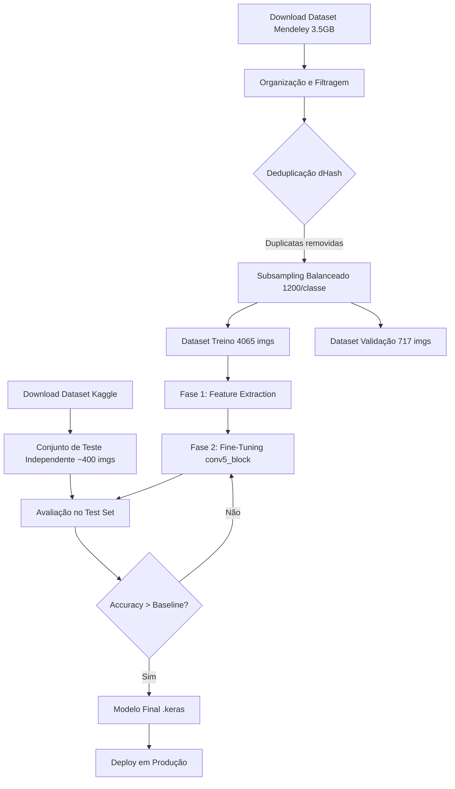

# RadioAI — Classificação de Raio-X Torácico com Deep Learning

> Sistema full-stack de classificação médica com **explainability**, **detecção de anomalias**, **monitoramento de drift** e **pipeline MLOps reproduzível**.

[](https://github.com/henriquebotelhogomes/Departamento_Medico_ML/releases)
[](https://github.com/henriquebotelhogomes/Departamento_Medico_ML/pkgs/container/radioai)
[](https://github.com/henriquebotelhogomes/Departamento_Medico_ML/actions/workflows/ci.yml)
[](LICENSE)
[](https://www.python.org/)
[](https://fastapi.tiangolo.com/)
[](https://react.dev/)
[](https://github.com/henriquebotelhogomes/Departamento_Medico_ML/discussions)

***

## 📸 Demonstração

<p align="center">
  
</p>

<p align="center"><em>Predição com <strong>mapa de atenção Grad-CAM</strong>: o modelo classifica o raio-X e destaca em vermelho/quente as regiões que mais influenciaram a decisão — trazendo <strong>explainability</strong> ao diagnóstico.</em></p>

| Painel de métricas | Documentação interativa da API (Swagger) |
| :---: | :---: |
|  |  |
| Estatísticas agregadas: volume total, confiança média, classe mais frequente e distribuição por classe. | API REST documentada automaticamente (OpenAPI): autenticação **JWT**, predições e estatísticas. |

| Histórico de predições | Detalhe da predição |
| :---: | :---: |
|  |  |
| Histórico paginado e filtrável por classe, persistido por usuário. Note as linhas **Out of Distribution** — imagens que **não são raio-X** são rejeitadas via similaridade de embeddings, evitando diagnósticos falsos. | Modal com o raio-X, a confiança da predição e a distribuição de probabilidade entre todas as classes. |

***

## Visão Geral

Aplicação de Machine Learning em produção que classifica imagens de raio-X torácico em **4 categorias clínicas** utilizando um modelo ResNet50 fine-tuned:

| Classe | Diagnóstico          |
| ------ | -------------------- |
| 0      | Covid-19             |
| 1      | Normal               |
| 2      | Pneumonia Viral      |
| 3      | Pneumonia Bacteriana |

> **Disclaimer**: Projeto de demonstração técnica — NÃO é uma ferramenta clínica validada.

***

## Datasets Utilizados

O modelo foi treinado utilizando **dois datasets complementares** de imagens de raio-X torácico, combinados para maximizar a diversidade e robustez:

### Dataset 1 — COVID-19 Radiography Database (Kaggle)

| Campo              | Valor                                                                                                                 |
| ------------------ | --------------------------------------------------------------------------------------------------------------------- |
| **Fonte**          | [Kaggle — COVID-19 Radiography Database](https://www.kaggle.com/datasets/tawsifurrahman/covid19-radiography-database) |
| **Papel**          | Dataset inicial de teste e validação                                                                                  |
| **Estrutura**      | 4 classes em diretórios separados                                                                                     |
| **Uso no projeto** | Conjunto de **teste final** (diretório `Test/`) — nunca visto durante treino                                          |

### Dataset 2 — Mendeley Chest X-ray (Curado)

| Campo                | Valor                                                                            |
| -------------------- | -------------------------------------------------------------------------------- |
| **Fonte**            | [Mendeley Data — 9xkhgts2s6 v4](https://data.mendeley.com/datasets/9xkhgts2s6/4) |
| **Tamanho original** | \~3.5 GB (zip) com milhares de imagens                                           |
| **Papel**            | Dataset principal de **treinamento e validação**                                 |
| **Subsampling**      | 1.200 imagens por classe (balanceado)                                            |
| **Deduplicação**     | Hashes perceptuais (dHash) para excluir duplicatas entre treino e teste          |
| **Anti-leakage**     | Imagens idênticas ao Test/ foram removidas automaticamente                       |

### Distribuição Final

| Conjunto  | Imagens | Split           | Fonte                 |
| --------- | ------- | --------------- | --------------------- |
| Treino    | 4.065   | 85% do Mendeley | Mendeley curado       |
| Validação | 717     | 15% do Mendeley | Mendeley curado       |
| Teste     | \~400   | Separado        | Kaggle (independente) |

***

## Processo de Treinamento

O treinamento seguiu uma estratégia de **3 fases progressivas**, partindo de um backbone congelado até fine-tuning seletivo:

### Fluxograma do Pipeline



### Fase 1 — Feature Extraction (Backbone Congelado)

| Parâmetro           | Valor                                                              |
| ------------------- | ------------------------------------------------------------------ |
| **Backbone**        | ResNet50 (ImageNet, congelado)                                     |
| **Saída**           | GlobalAveragePooling2D → vetor 2048-d                              |
| **Cabeça**          | Dropout(0.3) → Dense(256, ReLU) → Dropout(0.3) → Dense(4, Softmax) |
| **Otimizador**      | Adam (lr=1e-3)                                                     |
| **Épocas**          | Até 200 (EarlyStopping patience=20)                                |
| **Épocas efetivas** | 34                                                                 |
| **Loss**            | Categorical Crossentropy                                           |
| **Callbacks**       | EarlyStopping + ReduceLROnPlateau (factor=0.5, patience=6)         |
| **Val Accuracy**    | 84.4%                                                              |
| **Test Accuracy**   | 82.5% (sem TTA)                                                    |

### Fase 2 — Fine-Tuning Seletivo (conv5\_block)

| Parâmetro                 | Valor                                                                               |
| ------------------------- | ----------------------------------------------------------------------------------- |
| **Camadas descongeladas** | 22 (apenas `conv5_block*`, BatchNorm congelada)                                     |
| **Otimizador**            | Adam (lr=1e-5) — 100x menor que Fase 1                                              |
| **Épocas**                | 5                                                                                   |
| **Data Augmentation**     | RandomRotation(0.03), RandomZoom(0.1), RandomTranslation(0.05), RandomContrast(0.1) |
| **Checkpoint**            | Salva apenas se superar baseline anterior                                           |
| **Val Accuracy**          | 85.2%                                                                               |
| **Test Accuracy**         | 87.5% (sem TTA) / **92.5% (com TTA)**                                               |

### Fase 3 — Test-Time Augmentation (TTA)

| Parâmetro                | Valor                                |
| ------------------------ | ------------------------------------ |
| **Variações por imagem** | 10 augmentações + original           |
| **Agregação**            | Média das probabilidades softmax     |
| **Augmentações**         | Rotação, zoom, translação, contraste |
| **Ganho**                | +5% accuracy absoluto vs. sem TTA    |

### Evolução da Performance

```
┌─────────────────────────────────────────────────────────┐
│ Fase                  │ Test Acc (sem TTA) │ Test Acc (TTA) │
├───────────────────────┼────────────────────┼────────────────┤
│ Feature Extraction    │      82.5%         │     80.0%      │
│ Fine-Tuning conv5     │      87.5%         │     92.5%      │
│ Ganho absoluto        │     +5.0%          │    +12.5%      │
└─────────────────────────────────────────────────────────┘
```

### Decisões de Design

1. **Dois datasets separados** — O teste usa um dataset completamente independente (Kaggle), nunca exposto durante treino, garantindo avaliação sem viés
2. **Deduplicação perceptual (dHash)** — Remove imagens visualmente idênticas entre treino/teste, prevenindo data leakage
3. **Balanceamento por subsampling** — 1.200 imgs/classe evita bias para classes majoritárias
4. **BatchNorm congelada** — Evita instabilidade durante fine-tuning com batch pequeno
5. **LR 100x menor no fine-tuning** — Preserva features aprendidas no ImageNet
6. **Checkpoint com threshold** — Modelo só é salvo se superar a baseline anterior

***

## Diferenciais Técnicos

### Inteligência Artificial & MLOps

* **Grad-CAM (Explainability)** — Visualização de atenção do modelo via `tf.GradientTape`, mostrando *onde* o modelo focou para cada predição.

* **Detecção Out-of-Distribution (OOD)** — Rejeita automaticamente imagens que não são raio-X torácico usando similaridade cosseno no espaço de embeddings (2048-dim).

* **Compatibilidade Hospitalar DICOM (.dcm)** — Ingestão nativa de exames DICOM hospitalares com rotina de desidentificação de dados sensíveis do paciente (PS 3.15, em conformidade com HIPAA e LGPD) e extração de metadados técnicos (kVp, incidência PA/AP, modalidade CR/DX).

* **Consenso Diagnóstico & Laudos Multi-LLM** — Geração de laudos radiológicos estruturados (Técnica, Achados, Impressão, CID-10 e Recomendações) através de múltiplos modelos de fronteira:
  * **Google Gemini 3.8 / 2.5 Flash** (via Google AI Studio)
  * **GPT 5.6 Luna** (via OpenCode Zen `/responses`)
  * **DeepSeek V4 Flash** (via OpenCode Zen `/chat/completions`)
  * **Qwen 3.7 Plus** (via OpenCode Zen `/messages`)
  * **Motor Clínico Determinístico Local** (100% offline, sem consumo de API)
  * **Matriz Comparativa Lado a Lado (*Side-by-Side*)**: painel de consenso que confronta simultaneamente as impressões e condutas sugeridas pelas diferentes IAs.

* **Supervisão Médica & Human-in-the-Loop (HITL)** — Detecção proativa de empates técnicos e margens estreitas ($\Delta < 15\%$, como no dilema 51% Bacteriana vs 49% Viral), acionando alerta de ambiguidade etiológica e painel de intervenção soberana para o médico assistente sobrescrever a conduta, registrar justificativa com biomarcadores (Procalcitonina / PCR) e regerar o laudo formal.

* **Pipeline de treino reproduzível** — Script configurável via YAML com seeds fixas, class weights balanceados, two-phase training (freeze → fine-tune), e tracking completo via MLflow.

* **Validação estatística do threshold OOD** — ROC/AUC + Youden's J para definir threshold ótimo com evidência empírica.

* **Model Card** — Documentação completa seguindo padrões da indústria (bias, limitações, considerações éticas, métricas por classe).

* **Script de avaliação** — Gera confusion matrix, ROC curves (one-vs-rest), classification report e summary JSON automaticamente.

### Monitoramento & Observabilidade

* **Drift monitoring** — Detecção de concept drift e data drift via testes estatísticos (Chi-squared para distribuição de classes, Kolmogorov-Smirnov para confiança).

* **Logging estruturado** — JSON logs com `structlog`, correlation ID por request, contexto enriquecido.

* **Health check** — Endpoint `/api/health` verifica DB + modelo carregado.

* **Request logging** — Método, path, status, duração em ms para cada request.

### Segurança & Robustez

* **Rate limiting** — 10 predições/minuto por IP (slowapi) para proteger contra abuso.

* **Security headers** — X-Content-Type-Options, X-Frame-Options, HSTS, Referrer-Policy, Permissions-Policy.

* **CORS restritivo** — Apenas métodos e headers específicos permitidos.

* **JWT com refresh tokens** — Autenticação stateless com rotação de tokens.

### Arquitetura & Escalabilidade

* **Google Cloud Run (Scale-to-Zero - $0/mês)** — Deploy conteinerizado serverless com política de escala a zero instâncias, garantindo custo fixo de $0/mês para ambientes de portfólio.

* **Celery + Redis** *(opcional — extra `worker`)* — Worker assíncrono para inferência pesada, desacoplando do ciclo de request. Não instalado por padrão; requer `uv sync --extra worker` (ou `pip install -e ".[worker]"`) e uma instância Redis em execução.

* **Cache de predições** *(opcional — extra `worker`)* — SHA-256 hash → Redis com TTL, evitando re-inferência de imagens duplicadas. Degrada silenciosamente quando o Redis não está disponível.

* **Docker multi-stage** — Imagem otimizada combinando frontend build + backend em container único.

* **PostgreSQL + Alembic** — Migrations versionadas, connection pooling assíncrono.

* **Storage abstrato** — Interface que suporta local (dev) e Supabase (prod) sem mudança de código.

### Frontend & Experiência PACS

* **Estação PACS Clínica Interativa** — Visualizador médico profissional com controles de Zoom (50%-300%), Brilho (50%-200%), Contraste (50%-250%), Inversão Monocromática, Slider de Mapa de Calor Grad-CAM (0%-100%), Modo Tela Cheia e movimentação tátil (*pan & drag*).

* **Galeria 1-Click Demo** — Acesso imediato a 6 casos clínicos prontos (Normal, Covid-19, Pneumonia Bacteriana, Pneumonia Viral, Anomalia OOD e Exame DICOM hospitalar) para demonstração instantânea.

* **Motor de Impressão Hospitalar A4 Timbrada** — Emissão de laudo médico formatado para impressão ou exportação em PDF via `@media print`, gerando folha de 1 página A4 limpa com identificação clínica, seções médicas estruturadas, campo para carimbo/assinatura (CRM/RQE) e aviso legal regulatório.

* **Internacionalização (i18n)** — Suporte completo pt-BR/English com `react-i18next`, detecção automática do idioma do navegador.

* **Dark & Light Mode Clínico** — Contraste perfeitamente calibrado para salas escuras de radiologia e visualização em ambientes iluminados.

* **Confirmação de exclusão** — UX defensiva com two-step delete no histórico.

***

## Funcionalidades

| Feature                  | Descrição                                                                      |
| ------------------------ | ------------------------------------------------------------------------------ |
| **Estação PACS**         | Visualizador médico interativo com Zoom, Brilho, Contraste, Inversão e Grad-CAM|
| **1-Click Demo**         | Galeria com 6 radiografias e exames DICOM para teste diagnóstico instantâneo   |
| **Suporte DICOM (.dcm)** | Processamento hospitalar, desidentificação PS 3.15 (HIPAA/LGPD) e metadados    |
| **Laudos Multi-LLM**     | Laudos estruturados via Gemini 3.8, GPT 5.6, DeepSeek V4, Qwen 3.7 e Motor Local |
| **Consenso Lado a Lado** | Painel comparativo de impressões clínicas e CIDs entre múltiplas IAs           |
| **Human-in-the-Loop**    | Alerta de ambiguidade etiológica e sobrescrita soberana pelo médico radiologista|
| **Impressão Médica A4**  | Laudo hospitalar timbrado para impressão/PDF com campo de assinatura e CRM     |
| **Predição Drag & Drop** | Upload convencional com barras de probabilidade calibrada em tempo real        |
| **Histórico Paginado**   | Filtro por classe, modal de detalhes e exclusão segura                         |
| **Dashboard Analítico**  | Gráficos de volume, confiança média e distribuição temporal das predições      |
| **Autenticação JWT**     | Register/login/refresh com conta demo one-click                                |
| **Explainability**       | Mapas Grad-CAM destacando regiões pulmonares determinantes                     |
| **OOD Detection**        | Rejeição automática de imagens não torácicas via similaridade de embeddings    |
| **Drift Monitoring**     | Detecção estatística de data drift e concept drift                             |
| **Internacionalização**  | Interface completa bilíngue (Português e Inglês)                               |

***

## Quick Start

```bash
# Pré-requisitos: Python 3.12, Node 20, Git

git clone https://github.com/henriquebotelhogomes/Departamento_Medico_ML.git
cd Departamento_Medico_ML

# Backend
cd backend
pip install -e ".[dev]"        # ou: uv sync --extra dev
# Opcional — worker assíncrono + cache Redis (requer Redis rodando):
# pip install -e ".[worker]"   # ou: uv sync --extra worker
cd ..

# Frontend
cd frontend
npm install
cd ..

# Executar (dois terminais)
cd backend  && uvicorn app.main:app --reload --port 8000
cd frontend && npm run dev
```

Abra <http://localhost:5173> → login com **demo123 / demo123**.

### Com Docker

```bash
docker compose up --build
# API: http://localhost:8000
# Frontend: http://localhost:5173
```

***

## Estrutura do Projeto

```
├── backend/              API FastAPI, predictor ML, storage, DB, testes
│   ├── app/
│   │   ├── api/          Routers (auth, predictions, stats, system)
│   │   ├── core/         Config, security, logging, cache
│   │   ├── middleware/   Security headers
│   │   ├── ml/           Predictor (Grad-CAM, OOD, inference)
│   │   ├── monitoring/   Drift detection (chi², KS test)
│   │   ├── tasks/        Celery background tasks (opcional, extra `worker`)
│   │   └── worker.py     Celery app instance (opcional, extra `worker`)
│   ├── alembic/          Database migrations
│   └── tests/            pytest (auth, predictions, predictor, OOD)
│
├── frontend/             React 18 + Vite + TypeScript + Tailwind
│   └── src/
│       ├── locales/      Traduções (en.json, pt-BR.json)
│       ├── pages/        Login, Register, Predict, History, Dashboard
│       ├── components/   Layout, ProbabilityBar, ConfidenceBadge
│       └── __tests__/    Vitest (Predict, History)
│
├── training/             Pipeline MLOps
│   ├── train.py          Treino reproduzível com MLflow
│   ├── evaluate.py       Métricas + plots (confusion matrix, ROC)
│   ├── validate_ood_threshold.py  Validação estatística do threshold
│   └── config.yaml       Hiperparâmetros centralizados
│
├── models/               Model Card (MODEL_CARD.md)
├── examples/             Imagens de referência para OOD
├── docs/                 Documentação (MkDocs)
├── .github/workflows/    CI/CD (lint → test → build → docker)
└── docker-compose.yml    Orquestração de serviços
```

***

## Tech Stack

| Camada            | Tecnologias                                                                    |
| ----------------- | ------------------------------------------------------------------------------ |
| **ML & Visão**    | TensorFlow 2.21 · Keras 3.15 · ResNet50 · Grad-CAM · OOD Detection (Embeddings) |
| **Padrão Hospitalar** | Pydicom · Padrão DICOM PS 3.15 (Desidentificação HIPAA/LGPD) · Estação PACS  |
| **GenAI & Laudos**| Google Gemini 3.8 Flash · GPT 5.6 Luna · DeepSeek V4 · Qwen 3.7 · Motor Local  |
| **MLOps**         | MLflow · Treinamento Reproduzível · Model Card · Monitoramento de Data Drift   |
| **Backend**       | Python 3.12 · FastAPI · Pydantic v2 · SQLAlchemy 2 (async) · Celery (opcional) |
| **Frontend**      | React 18 · Vite · TypeScript · Tailwind CSS · TanStack Query · Lucide · i18next|
| **Database**      | SQLite (dev) / PostgreSQL (prod) · Alembic migrations · Redis cache (opcional) |
| **Segurança**     | JWT + Refresh Tokens · Rate Limiting · Security Headers · CORS Restritivo      |
| **DevOps & Cloud**| Google Cloud Run (Scale-to-Zero $0/mês) · Docker multi-stage · GitHub Actions CI|
| **Qualidade**     | ruff · pytest (36 testes) · Vitest (17 testes) · pre-commit hooks              |

***

## Testes Automatizados

```bash
# Backend (36 testes: auth, predictions, stats, system, predictor, OOD, DICOM e laudos Multi-LLM)
cd backend && uv run python -m pytest

# Frontend (17 testes: PACS viewer, login, predict demo, history, new exam upload)
cd frontend && npm run test

# Linting e Validação Estática
cd backend && uv run ruff check .
cd frontend && npm run lint && npm run build
```

***

## Pipeline MLOps

```bash
cd training

# Treinar modelo (requer dataset + GPU recomendada)
python train.py --config config.yaml

# Avaliar modelo (gera métricas e plots)
python evaluate.py --model ../models/chest_xray_model.keras --test-dir ../data/chest_xray/test

# Validar threshold OOD (análise estatística)
python validate_ood_threshold.py
```

Resultados são registrados automaticamente no **MLflow** com:

* Hiperparâmetros completos
* Métricas por época (train/val accuracy)
* Métricas finais (accuracy, F1, precision, recall por classe)
* Modelo serializado como artefato

***

## Deploy em Produção

| Plataforma                 | Método                                                         | Custo Estimado |
| -------------------------- | -------------------------------------------------------------- | -------------- |
| **Google Cloud Run**       | Conteinerizado Serverless via Cloud Build / Artifact Registry  | **$0/mês** (Scale-to-Zero)|
| **Render**                 | Auto-deploy via `render.yaml` Blueprint                        | Free Tier      |
| **Docker Compose**         | `docker compose up --build` (PostgreSQL + API + Frontend)      | Local / VPS    |
| **HuggingFace Spaces**     | Multi-stage Dockerfile, `PORT=7860`                            | Free Tier      |

Veja [docs/deploy.md](docs/deploy.md) para o guia detalhado de implantação.

#

***

## Licença

MIT
