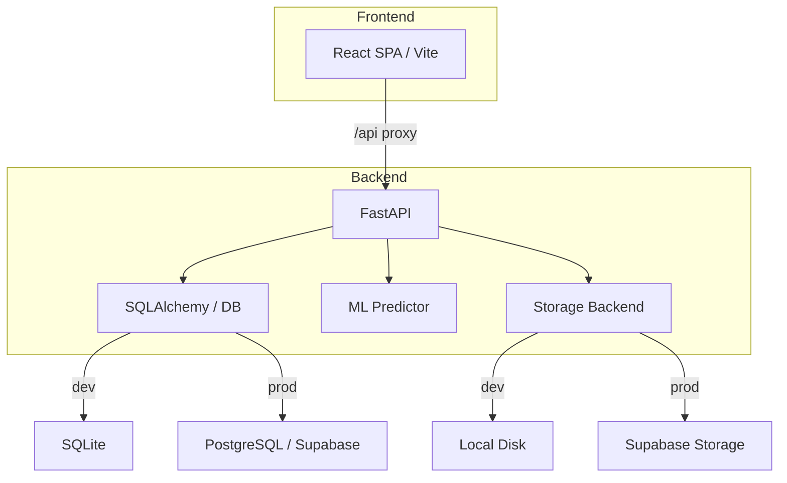

# Architecture

RadioAI is structured as a monorepo with two main packages:

## Production deployment

A single Docker container built with the root `Dockerfile`:

1. **Stage 1** — Node builds the React SPA into static files.
2. **Stage 2** — Python + uv installs the backend, copies the SPA into `app/static`.

FastAPI's `StaticFiles` mount at `/` serves the SPA; API routes live under `/api`.

## Key design choices

- **Config-driven DB**: `DATABASE_URL` switches between SQLite (local dev) and PostgreSQL (Supabase prod) with zero code changes.
- **Config-driven Storage**: `STORAGE_BACKEND` env toggles between local filesystem and Supabase Storage (signed URLs).
- **Lazy model singleton**: The Keras model loads once on startup; if the file is missing the app still starts (API docs remain accessible).
- **uv for Python deps**: Deterministic lockfile, no `requirements.txt`.
