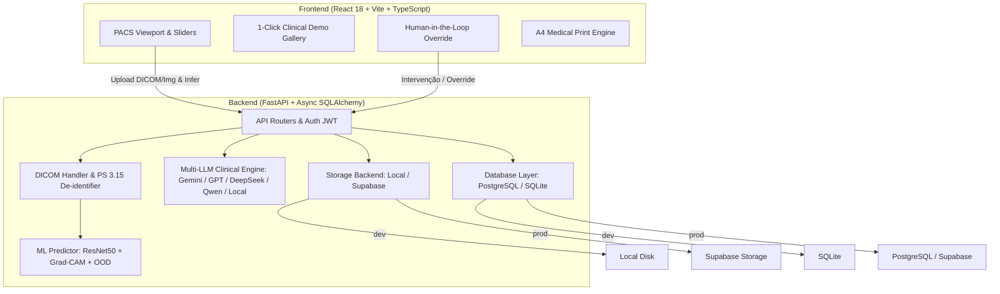

# Architecture

RadioAI segue uma arquitetura modular de padrão hospitalar (*Enterprise MedTech*):

## Production deployment

O sistema suporta implantação conteinerizada multi-stage:

1. **Stage 1** — Node 20 compila o SPA React otimizado com Tailwind CSS e tipos estritos.
2. **Stage 2** — Python 3.12 + `uv` instala o backend FastAPI e embute os assets em `app/static`.
3. **Scale-to-Zero ($0/mês)** — Deploy otimizado no **Google Cloud Run** permitindo redução automática a 0 instâncias quando ocioso.
4. **Always-on** — Deploy em **Render** ou instâncias dedicadas via `render.yaml` ou `docker-compose.yml`.

## Key design choices

- **De-identification HIPAA/LGPD**: Processamento seguro de arquivos DICOM com anonimização automática de tags PS 3.15 antes da persistência.
- **Human-in-the-Loop (HITL)**: Detecção estatística de margem estreita ($\Delta < 15\%$) e poder de sobrescrita soberana para o médico assistente.
- **Consenso Multi-LLM**: Roteamento dinâmico para Google AI Studio e OpenCode Zen, com fallback resiliente para motor médico determinístico local.
- **Config-driven DB**: `DATABASE_URL` alterna entre SQLite (local dev) e PostgreSQL (Supabase prod) sem alteração de código.
- **Config-driven Storage**: `STORAGE_BACKEND` alterna entre disco local e Supabase Storage (signed URLs).
- **Lazy model singleton**: O modelo Keras é carregado no startup; se o arquivo não estiver presente, a aplicação degrada graciosamente mantendo a documentação e histórico acessíveis.
- **uv para dependências Python**: Lockfile determinístico congelado (`uv.lock`), garantindo builds rápidos e reproduzíveis.
